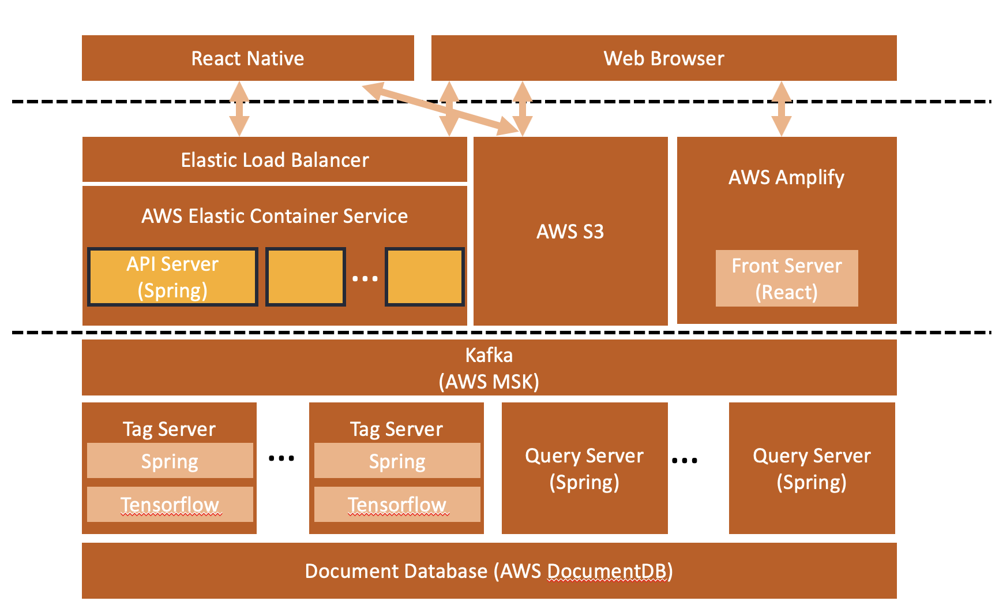
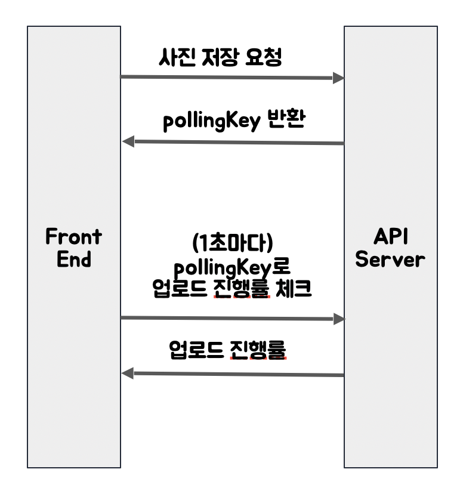
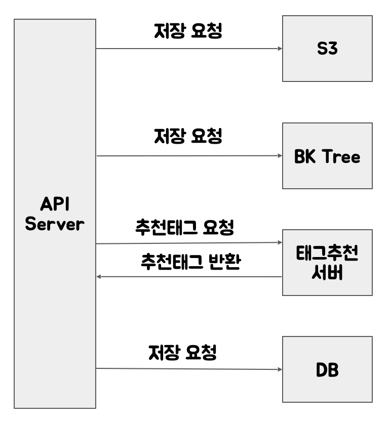
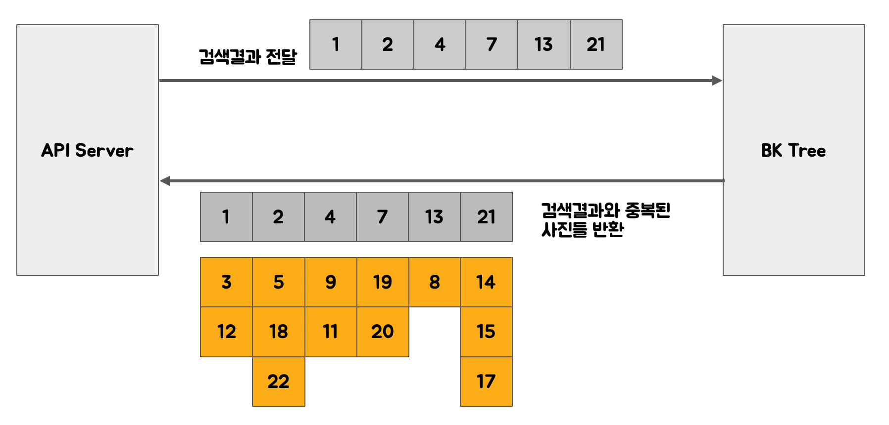
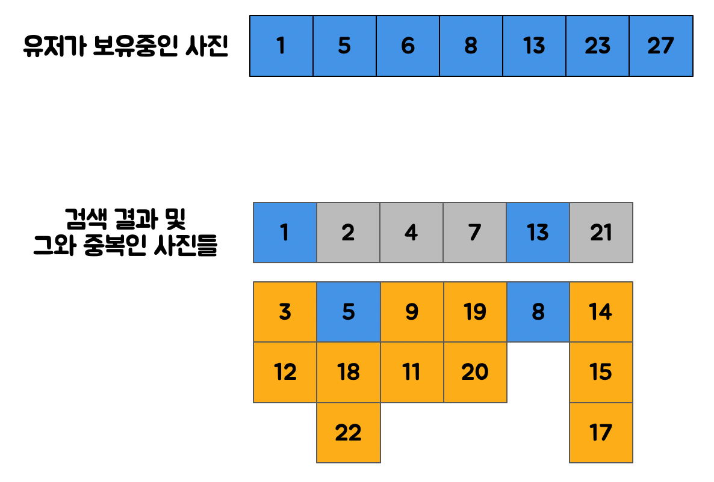
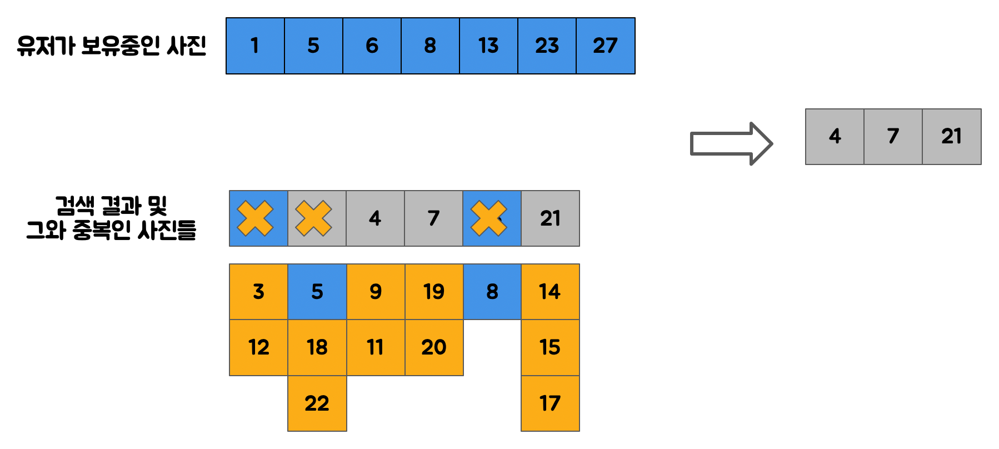

# API Server

## 공통부분

## Key Features
- 프론트엔드로부터 받은 이미지 업로드, 검색, 저장, 수정 등의 요청을 처리하는 서버입니다
- BK Tree Server 및 DB 와 통신해 나에게 없는 사진 검색 결과를 보여줍니다
- Tag Server 와 통신해 이미지 추천 태그를 유저에게 보내줍니다
- Google Drive API 와 S3 SDK 를 사용해 이미지를 업로드합니다

## Google Drive로 업로드
프론트엔드에서 업로드 요청이 오면, 작업을 큐에 쌓고 진행률 체크를 위한 pollingKey를 반환합니다. 이후 각 사진을 업로드할 때, S3, BK Tree, DB에 저장요청을 보냅니다.

## 나에게 없는 사진만 보여주기
BK Tree 에게서 검색결과와 중복인 사진들을 받아오고, 이들중 유저가 보유중인 사진과 겹치지 않는 사진만 최종 검색 결과로 반환합니다.

 

 

## How To Use
1. application.properties 파일 작성 (application.properties.example 파일을 참고)
1. `./gradlew build`
1. `./gradlew bootRun`

## API Documentation
http://udhd.djbaek.com:8080/docs/api-doc.html
